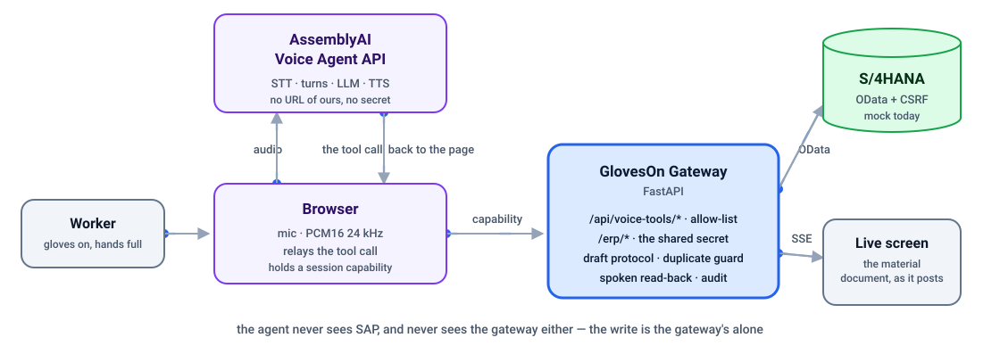
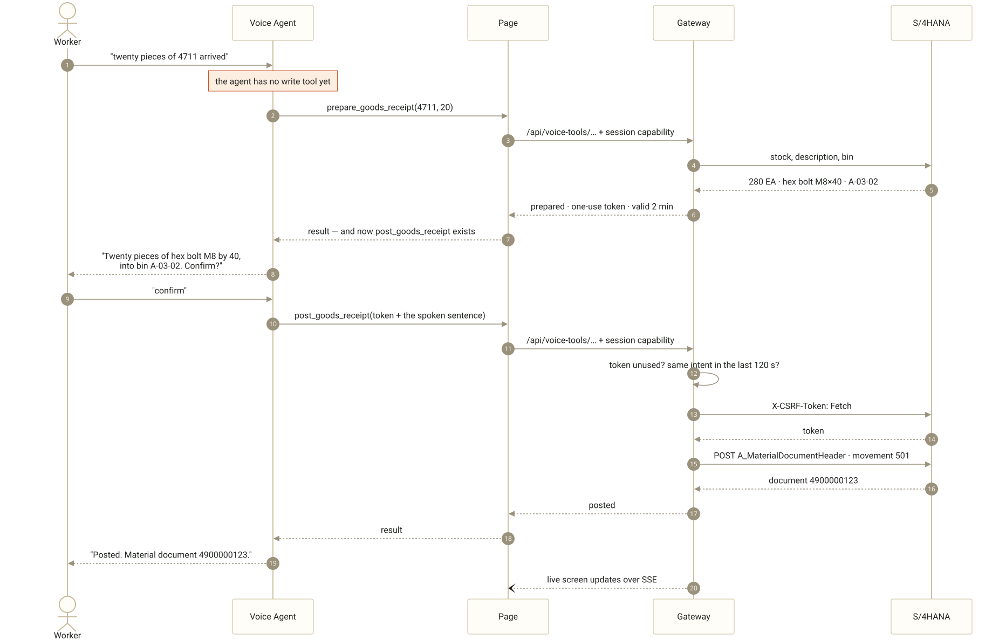

<h1 align="center">GlovesOn</h1>
<p align="center"><b>Hands-free warehouse operator — a voice agent that <i>writes</i> to SAP.</b></p>

<p align="center">
  
  
  
  
  
  <a href="https://github.com/kosesena/GlovesOn/actions/workflows/ci.yml"></a>
</p>

<p align="center">
  <b><a href="https://gloveson.vercel.app">Live demo</a></b> ·
  <b><a href="docs/JUDGE-GUIDE.md">Judge guide</a></b> — every claim, the file it lives in, and the command that checks it
</p>

---

A worker on a receiving dock has both hands on a pallet. Ask *"how many of material four
seven one one do we have?"* and the answer comes back spoken. Say *"post a goods receipt,
twenty pieces"* and — after the agent reads the line back and the worker confirms out
loud — a **real material document is posted** and stock moves on screen.

That last sentence is the whole project. A chat agent that answers wrongly is corrected by
asking again. An agent that posts a wrong material document leaves a document a human has
to reverse. Every design decision below follows from that difference.

Built for the AssemblyAI Voice Agent Hackathon, September 2026.

---

## Architecture

<p align="center">
  <picture>
    <source media="(prefers-color-scheme: dark)" srcset="docs/img/architecture-dark.svg">
    
  </picture>
</p>

**The agent never sees SAP.** It speaks in warehouse terms (`/erp/stock`,
`/erp/goods-receipt`); the gateway owns authentication, SAP field translation and every
guardrail around writing. That boundary is [ADR-0001](docs/adr/0001-gateway-between-agent-and-erp.md),
and it is why swapping the mock for a real tenant is a change of environment variable
rather than a change of code.

---

## The part that matters: a confirmed write

<p align="center">
  <picture>
    <source media="(prefers-color-scheme: dark)" srcset="docs/img/confirmed-write-dark.svg">
    
  </picture>
</p>

<sub align="center">Click the diagram to open it full size. Source: <a href="docs/img/confirmed-write.mmd"><code>docs/img/confirmed-write.mmd</code></a>.</sub>

Four things in that diagram are deliberate and each one costs something:

- **The read-back names four things** — quantity, unit, material *description* and
  destination bin. The description is load-bearing: it is what lets a worker catch that
  they are holding nuts, not bolts. It costs about two seconds per posting.
- **The worker is asked for two things only**: material and quantity. Bin, unit, plant and
  storage location are looked up first. Asking "which bin?" is the exact friction this
  product exists to remove.
- **The duplicate guard lives in the gateway, not the mock.** Real S/4HANA accepts the
  same goods receipt twice without complaint, so the guard has to survive the move to a
  real system. It reads recent documents back from SAP rather than remembering anything,
  which keeps the gateway stateless.
- **`execution_mode: "hold"`** — the agent waits for the ERP instead of narrating an
  optimistic success. A write whose result you cannot see may already have happened, so
  the agent never retries one on its own.

Reasoning in full: [ADR-0002 — confirm before write](docs/adr/0002-confirm-before-write.md).

## Nothing is deleted. It is reversed.

A wrong document is not removed, because SAP does not remove documents and neither should
we. The agent posts a **reversal**: a 102 against a 101, a 502 against a 501. Both
documents stay, and the audit trail says what happened and that someone undid it.

```
"reverse material document four nine zero zero zero zero zero one two three"
   → agent reads the original back: 20 EA hex bolt M8×40, bin A-03-02, posted 14:22
   → "confirm"
   → 102 posted against it. Stock returns. Two documents now exist, not zero.
```

The agent says *reverse*, never *delete*. A document already reversed cannot be reversed
again, and a reversal is refused if the original has scrolled out of the recent window —
refusing is cheaper than guessing.

---

## Talking to SAP

The gateway does not fake SAP. It speaks the released OData APIs over HTTP, with the CSRF
handshake a real S/4HANA demands.

| Released API | Entity | Used for |
|---|---|---|
| `API_MATERIAL_DOCUMENT_SRV` | `A_MaterialDocumentHeader` | goods receipt · reversal *(write)* |
| `API_MATERIAL_STOCK_SRV` | `A_MatlStkInAcctMod` | on-hand stock |
| `API_PRODUCT_SRV` | `A_ProductDescription` | material description |
| `API_PURCHASEORDER_PROCESS_SRV` | `A_PurchaseOrder` | purchase order status |

Every write follows the sequence a real integration must follow: fetch a token from the
service root with `X-CSRF-Token: Fetch`, then POST the document carrying it. A write
without the token is refused with `CSRF_TOKEN_INVALID`, exactly as S/4HANA refuses it; the
client refreshes once and retries when it expires.

The posted body is the real one:

```json
{ "PostingDate": "…", "GoodsMovementCode": "05",
  "to_MaterialDocumentItem": [ { "Material": "000000000000004711", "Plant": "1000",
    "StorageLocation": "0001", "GoodsMovementType": "501",
    "EntryUnit": "EA", "QuantityInEntryUnit": "20" } ] }
```

`GoodsMovementCode` is not decoration: **01** is a receipt against a purchase order and
**05** one without, and the movement type must agree with it. Send 101 with code 05 and
the system refuses the document.

A stock question costs **two** calls, not one — stock and description live in different
APIs. That is how S/4HANA actually works, and it appears in the latency budget rather than
being wished away.

**Where the mock sits.** `gateway/sap_mock.py` implements that OData surface and stands
*opposite* the gateway, not inside it — the gateway reaches it over HTTP like any other
system. Pointing `SAP_BASE_URL` at a real tenant is therefore the entire migration,
because there is no second code path. ([ADR-0003](docs/adr/0003-mock-erp-behind-a-faithful-contract.md))

Field fidelity: `MATNR` (18-char zero-padded), `MAKTX`, `WERKS`, `LGORT`, `LGPLA`,
`LABST`, `MEINS`, documents in `MKPF`, movement types **101 / 102 / 501 / 502**.

---

## What the agent is made of

Six tools, two of which write. Both writes are unreachable without a spoken read-back and
an unmistakable yes.

| Tool | Mode | What it does |
|---|---|---|
| `get_stock` | interactive | on-hand quantity, unit, description, bin |
| `search_material` | interactive | find a material by description |
| `get_purchase_order` | interactive | PO status and open quantity |
| `get_recent_documents` | interactive | what was posted just now |
| **`post_goods_receipt`** | **hold** | posts a material document |
| **`reverse_goods_receipt`** | **hold** | posts the reversal of one |

| AssemblyAI feature | Where |
|---|---|
| Voice Agent API, browser deployment | `web/index.html` |
| HTTP tools with a shared secret header | `agent/agent.json` |
| `execution_mode: "hold"` on both writes | the agent waits for the ERP, and says so |
| `transcription_prompt` | a receiving dock: forklift noise, spoken material numbers |
| `keyterms` | material numbers, movement vocabulary, spelled-out digits |
| `turn_detection` | `min_silence: 800` · `max_silence: 2000` — adaptive pacing is deliberately **off** |
| Barge-in | `interrupt_response: true`; the client flushes queued audio on `input.speech.started` |
| Session token minting | `GET /api/voice-token` — the API key never reaches the browser |

Measured limits and open gaps — including accents and non-native speakers, still
untested — are in [docs/nfr.md](docs/nfr.md), not glossed over here.

---

## Design decisions

The reasoning is written down, not left in the code. Each record names the rejected
options and what the choice costs.

- **[docs/adr/](docs/adr/)** — why a gateway between agent and ERP · why every write is
  confirmed out loud · why the mock is faithful rather than convenient · why the browser
  came before telephony
- **[docs/nfr.md](docs/nfr.md)** — latency budget, concurrency ceiling, failure modes,
  security posture, cost model, known defects
- **[docs/clean-core.md](docs/clean-core.md)** — where this complies with SAP Clean Core
  and, at greater length, where it does not
- **[docs/market.md](docs/market.md)** — the competitive landscape, adversarially
  fact-checked: who already writes to SAP by voice, what Joule does, and the claims this
  project may not make
- **[docs/business-case.md](docs/business-case.md)** — who this is for and what it
  displaces: the unplanned pallet, the ~$5,000-per-seat incumbent norm, and the ROI
  figure deliberately not quoted until session length is measured
- **[docs/deploy-vercel.md](docs/deploy-vercel.md)** — the deployment runbook and what a
  redeploy costs you

Start with [ADR-0001](docs/adr/0001-gateway-between-agent-and-erp.md) if you read only one,
or [the judge guide](docs/JUDGE-GUIDE.md) if you would rather check the claims than read about
them — it maps each one to a file and a command, and ends with what this system does not do.

---

## Run it

```bash
pip install -r requirements.txt
cp .env.example .env     # ASSEMBLYAI_API_KEY and TOOL_SHARED_SECRET are required
```

`TOOL_SHARED_SECRET` has no default: the gateway refuses to start without one. Refusing to
start is loud; serving unprotected writes is quiet.

Three tabs — the scripts find the virtualenv themselves:

```bash
./serve.sh      # gateway on :8000
./tunnel.sh     # public HTTPS — prints a NEW address every time
./publish.sh    # push agent/agent.json to AssemblyAI
```

Between the second and third: put the tunnel address into `GATEWAY_PUBLIC_URL` in `.env`.
AssemblyAI refuses to save an agent whose tool host does not resolve, so a stale address
fails the publish with a 422 instead of failing silently in front of an audience. Then
open **http://localhost:8000 in Chrome** — Safari does not reliably give the
`AudioContext` the 24 kHz rate the API expects.

> **The tunnel is not optional in local development.** AssemblyAI calls tool endpoints
> from its own servers: HTTPS and public hosts only, loopback blocked, redirects not
> followed.

## Deployment

The gateway runs on **Vercel**, with the mock's data in **Postgres** (Neon). That
combination is not the shape this system was first written in: Vercel runs requests, not
processes, so the state that used to live in a SQLite file and in memory — the mock's
data, the live event stream, the voice-session counter — had to move into the database.
[ADR-0005](docs/adr/0005-serverless-deployment-and-shared-state.md) records why that
trade was made, what it costs, and the cheaper options that were turned down.

Steps, secrets and the things that bite are in
[docs/deploy-vercel.md](docs/deploy-vercel.md). The code still runs unchanged on an
always-on host if that trade ever stops being worth it.

---

## Try saying

- *"How many of material four seven one one do we have?"*
- *"Where are the ball bearings stored?"*
- *"What's the status of purchase order four five zero zero zero zero one two three five?"*
- *"Post a goods receipt, twenty pieces of four seven one one"* → then **"confirm"**
- Say the same sentence again — the second one is refused, not posted twice.
- *"Reverse material document …"* → then **"confirm"**
- Interrupt the agent mid-sentence. Barge-in is on.

## Layout

```
agent/agent.json        system prompt + 6 HTTP tools
agent/publish.py        publishes it; fills placeholders from .env
gateway/main.py         tool endpoints, SSE feed, token minting, write guardrails
gateway/sap_client.py   the only thing that speaks SAP — OData + CSRF
gateway/sap_mock.py     the mock S/4HANA, reached over HTTP like a real one
gateway/store.py        the mock's data, in Postgres
gateway/live.py         live events + voice-session counter, also in Postgres
web/index.html          voice client + live ERP screen — one file, no dependencies
docs/                   ADRs, NFRs, Clean Core assessment, deploy runbook
```

## Safety design

Reads are free; a write is not. Neither write is reachable without the spoken read-back
and an explicit yes. Independently of anything the model does, the gateway rejects unknown
materials, non-integer and non-positive quantities, a duplicate of a posting made in the
last two minutes, a reversal of an already-reversed document, and any call that does not
carry the shared tool secret. A mis-behaving prompt still cannot corrupt stock.

What is *not* solved is named rather than hidden: the posting is made by a service user,
not by the worker, so SAP cannot say who did it. That gap is written up in
[docs/clean-core.md](docs/clean-core.md).

## License

MIT — see [LICENSE](LICENSE).
