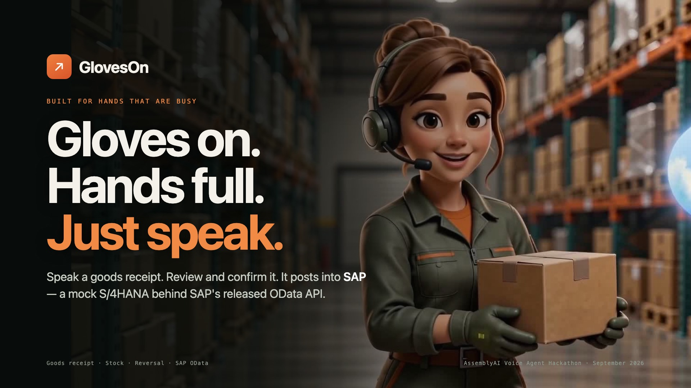
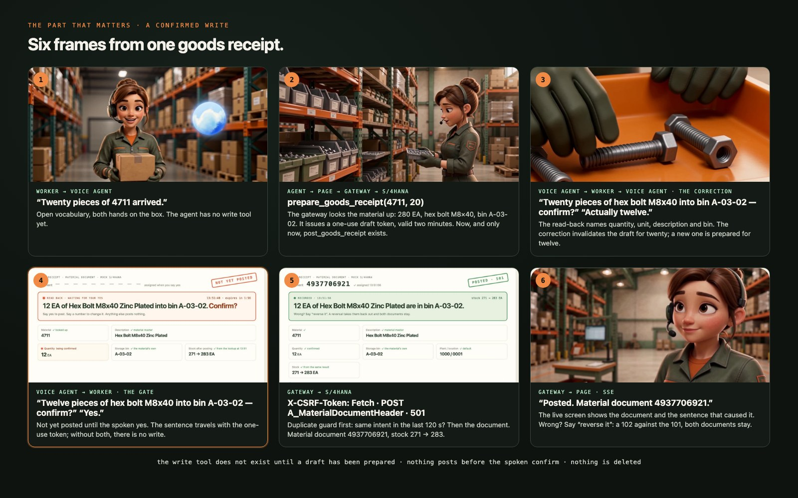
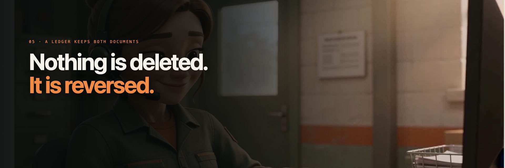
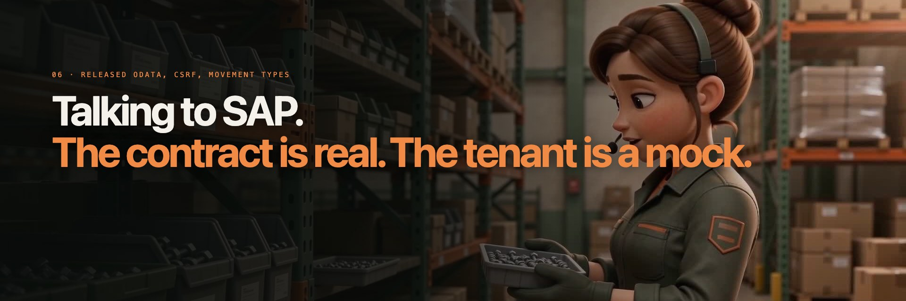
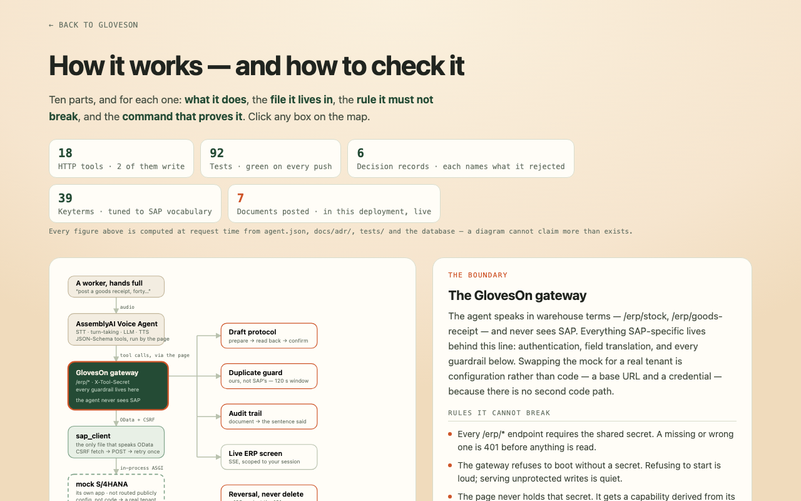

<h1 align="center">GlovesOn</h1>
<p align="center"><b>A voice agent that posts goods receipts into SAP — read back, confirmed, reversible. Built on the AssemblyAI Voice Agent API.</b></p>

<p align="center">
  <a href="https://gloveson.space"></a>
</p>

<p align="center">
  <a href="https://github.com/kosesena/GlovesOn/actions/workflows/ci.yml"></a>
</p>

<p align="center">
  <b><a href="https://gloveson.space">Live demo</a></b> ·
  <b><a href="https://gloveson.space/how-it-works">How it works</a></b> — the map, in the browser: every part, its file, its rule, its test ·
  <b><a href="docs/JUDGE-GUIDE.md">Judge guide</a></b> — the same evidence, in the repo
</p>

---

Lena works a receiving dock, and both hands are under a box. Ask *"how many of material four
seven one one do we have?"* and the answer comes back spoken. Say *"post a goods receipt,
twenty pieces"* and — after the agent reads the line back and Lena confirms out
loud — a **numbered material document is posted** through SAP's released OData API, and
stock moves on screen. The tenant behind it is a mock; the contract, the CSRF handshake
and the document are not.

That is the whole project. A chat agent that answers wrongly is corrected by asking again.
An agent that posts a wrong material document leaves a document a human has to reverse.
Every design decision below follows from that difference.

**Built by someone who spent an internship on SAP projects** — which is why the details
this agent gets right are the ones you only meet inside the system. Material numbers are
eighteen characters, zero-padded, though nobody says them that way out loud. A goods
receipt against a purchase order is movement type 101; without one it is 501. A mistake is
never deleted — it is a 102 posted against the 101, and both documents stay, because that
is what a ledger is. And real S/4HANA will accept the same goods receipt twice without
complaining, which is why the duplicate guard lives in *our* gateway rather than in the
mock, where it would have made the demo pass and the product wrong.

The same experience is why the limit is named rather than buried: the posting is made by a
service user, so SAP cannot say *who* spoke. Closing that needs principal propagation, and
[`docs/clean-core.md`](docs/clean-core.md) spends a page on it instead of hoping nobody
asks.

**Who it is for, by the numbers.** The receiving clerk on the dock — one of 844,120 in the US
alone (BLS, May 2023), measured on dock-to-stock hours, at sites where about 40 % still record
on paper (MMH 2025). What GlovesOn measures for her: **8 seconds** from her spoken yes to a
material document number, on the live app; two documents after a mistake, never one; zero writes
without the yes. Every number and its source: [`docs/named-user.md`](docs/named-user.md).

Built for the AssemblyAI Voice Agent Hackathon, September 2026.

---

## Lena's workspace

Conversation stays on the left; actual tool results appear on the right as an
ERP page, a work phone or an email/notes screen. The fictional directory includes
a supervisor, receiving colleague and maintenance colleague. Calls create demo
logs; email goes to a demo outbox. Every save requires its own prepared draft,
read-back and fresh spoken confirmation. No real call or email is delivered.

Guided tasks now include damaged deliveries and dropped items. Lena can propose
a call, email or incident note. A damage report does not silently post usable
stock or perform a scrap movement. **Practice** holds the optional scenario
builder; creating a brief does not change inventory or complete a task.

See [workspace behavior and validation](docs/agent-workspace.md) for what each
communication flow does, what it refuses, and how it was checked.

## Architecture

<p align="center">
  
</p>

**The agent never sees SAP.** It asks for a tool by name and gets warehouse terms back —
quantity, unit, description, bin. The gateway owns authentication, SAP field translation
and every guardrail around writing. That boundary is
[ADR-0001](docs/adr/0001-gateway-between-agent-and-erp.md), and it is why swapping the
mock for a real tenant is a change of environment variable rather than a change of code.

**The agent never sees the gateway either.** Its tool call comes back down the same
WebSocket that carries the audio, and the *browser* posts it on with a capability minted
for that session alone. Nothing at AssemblyAI holds our address or our secret, and the
two write tools are not in the configuration the agent receives at all: they are added
only while a prepared draft is live, and taken away again the moment it is not. That is
[ADR-0006](docs/adr/0006-tool-calls-return-to-the-browser.md), and it is also what it
costs — the browser is in the write path now, so the rules that matter are the ones the
gateway enforces after the relay, never the ones the page enforces before it.

---

<p align="center"></p>

## The part that matters: a confirmed write

<p align="center">
  
</p>

<p align="center">
  
</p>

Five things in those frames are deliberate and each one costs something:

- **The write tool does not exist yet at step one.** `post_goods_receipt` is absent from
  the configuration the agent is given, and appears only once a preparation has returned a
  one-use token bound to the exact details about to be read back. It is removed again on
  any turn that is not an unmistakable yes, on expiry two minutes later, and for the rest
  of the session once a write result has been lost. Refusing to use a tool is a decision a
  model makes; not having one is not.
- **The read-back names four things** — quantity, unit, material *description* and
  destination bin. The description is load-bearing: it is what lets a worker catch that
  they are holding nuts, not bolts. It costs about two seconds per posting.
- **The worker is asked for two things only**: material and quantity. Bin, unit, plant and
  storage location are looked up first. Asking "which bin?" is the exact friction this
  product exists to remove.
- **The duplicate guard lives in the gateway, not the mock.** Real S/4HANA accepts the
  same goods receipt twice without complaint, so the guard has to survive the move to a
  real system. It reads recent documents back from SAP rather than remembering anything,
  which keeps the gateway stateless.
- **`execution_mode: "hold"`** — the agent waits for the ERP instead of narrating an
  optimistic success. A write whose result you cannot see may already have happened, so
  the agent never retries one on its own.

Reasoning in full: [ADR-0002 — confirm before write](docs/adr/0002-confirm-before-write.md).

<p align="center"></p>

## Nothing is deleted. It is reversed.

A wrong document is not removed, because SAP does not remove documents and neither should
we. The agent posts a **reversal**: a 102 against a 101, a 502 against a 501. Both
documents stay, and the audit trail says what happened and that someone undid it.

```
"reverse material document four nine zero zero zero zero zero one two three"
   → agent reads the original back: 20 EA hex bolt M8×40, bin A-03-02, posted 14:22
   → "confirm"
   → 102 posted against it. Stock returns. Two documents now exist, not zero.
```

The agent says *reverse*, never *delete*. A document already reversed cannot be reversed
again, and a reversal is refused if the original has scrolled out of the recent window —
refusing is cheaper than guessing.

---

<p align="center"></p>

## Talking to SAP

### Connection status — rechecked 11 September 2026

**GlovesOn currently uses its mock SAP environment.** Goods receipts, stock queries
and reversals in the demo do not write to a company's SAP system.

A personal SAP Business Accelerator Hub sandbox key has been obtained and stored
locally in the gitignored `.env`. A read-only control request to SAP's SuccessFactors
sandbox returned **HTTP 200**, confirming that the key works. The four S/4HANA
services below returned **HTTP 401**, including a material-document read through
the Hub's own **Try Out** screen. This points to an S/4HANA sandbox access problem;
the precise SAP-side cause is not confirmed.

Rechecked on 11 September: the same four services still answer 401. Sending the
same request with no key returns `FailedToResolveAPIKey` from SAP's API gateway
and with a made-up key `Invalid ApiKey`, while our key returns neither and
reaches the backend's own logon failure instead. The key is accepted; the refusal
happens behind the gateway.

SuccessFactors was used only to check the key. Development continues against the
mock; **real S/4HANA reads and writes remain unverified**. No paid service was
activated during these checks. Recheck the required S/4HANA sandbox endpoints
before switching the demo backend or claiming a working SAP connection.

### OData contract

The gateway does not fake SAP. It speaks the released OData APIs over HTTP, with the CSRF
handshake a real S/4HANA demands.

| Released API | Entity | Used for |
|---|---|---|
| `API_MATERIAL_DOCUMENT_SRV` | `A_MaterialDocumentHeader` | goods receipt · reversal *(write)* |
| `API_MATERIAL_STOCK_SRV` | `A_MatlStkInAcctMod` | on-hand stock |
| `API_PRODUCT_SRV` | `A_ProductDescription` | material description |
| `API_PURCHASEORDER_PROCESS_SRV` | `A_PurchaseOrder` | purchase order status |

Every write follows the sequence a real integration must follow: fetch a token from the
service root with `X-CSRF-Token: Fetch`, then POST the document carrying it. A write
without the token is refused with `CSRF_TOKEN_INVALID`, exactly as S/4HANA refuses it; the
client refreshes once and retries when it expires.

The posted body is the real one:

```json
{ "PostingDate": "…", "GoodsMovementCode": "05",
  "to_MaterialDocumentItem": [ { "Material": "000000000000004711", "Plant": "1000",
    "StorageLocation": "0001", "GoodsMovementType": "501",
    "EntryUnit": "EA", "QuantityInEntryUnit": "20" } ] }
```

`GoodsMovementCode` is not decoration: **01** is a receipt against a purchase order and
**05** one without, and the movement type must agree with it. Send 101 with code 05 and
the system refuses the document.

A stock question costs **two** calls, not one — stock and description live in different
APIs. That is how S/4HANA actually works, and it appears in the latency budget rather than
being wished away.

**Where the mock sits.** `gateway/sap_mock.py` implements that OData surface and stands
*opposite* the gateway, not inside it — the gateway reaches it over HTTP like any other
system. Pointing `SAP_BASE_URL` at a real tenant is therefore the entire migration,
because there is no second code path. ([ADR-0003](docs/adr/0003-mock-erp-behind-a-faithful-contract.md))

Field fidelity: `MATNR` (18-char zero-padded), `MAKTX`, `WERKS`, `LGORT`, `LGPLA`,
`LABST`, `MEINS`, documents in `MKPF`, movement types **101 / 102 / 501 / 502**.

---

## What the agent is made of

Eight tools. Two prepare a write and two perform one — and neither write is reachable
without the draft its preparation minted: a one-use token bound to the exact details that
were read back, consumed together with the spoken yes.

| Tool | Mode | What it does |
|---|---|---|
| `get_stock` | interactive | on-hand quantity, unit, description, bin |
| `search_material` | interactive | find a material by description |
| `get_purchase_order` | interactive | PO status and open quantity |
| `get_recent_documents` | interactive | what was posted just now |
| `prepare_goods_receipt` | hold | mints the one-use draft a receipt must present |
| `prepare_reversal` | hold | the same, for a reversal |
| **`post_goods_receipt`** | **hold** | posts a material document — draft token required |
| **`reverse_goods_receipt`** | **hold** | posts the reversal of one — draft token required |

| AssemblyAI feature | Where |
|---|---|
| Voice Agent API, browser deployment | `web/index.html` |
| Inline session configuration, built per request | `gateway/voice_tools.py` — no agent is published, and the provider holds no URL or secret of ours |
| JSON-Schema function tools, answered by the page | tool calls return over the WebSocket; `web/voice-policy.js` decides which exist right now |
| `execution_mode: "hold"` on both writes | the agent waits for the ERP, and says so |
| `transcription_prompt` | a receiving dock: forklift noise, spoken material numbers |
| `keyterms` | material numbers, movement vocabulary, spelled-out digits |
| `turn_detection` | `min_silence: 800` · `max_silence: 2000` — adaptive pacing is deliberately **off** |
| Barge-in | `interrupt_response: true`; the client flushes queued audio on `input.speech.started` |
| Session token minting | `GET /api/voice-token` — the API key never reaches the browser |

Measured limits and open gaps — including accents and non-native speakers, still
untested — are in [docs/nfr.md](docs/nfr.md), not glossed over here.

---

## Design decisions

The reasoning is written down, not left in the code. Each record names the rejected
options and what the choice costs.

- **[docs/adr/](docs/adr/)** — why a gateway between agent and ERP · why every write is
  confirmed out loud · why the mock is faithful rather than convenient · why the browser
  came before telephony · why the state left the process · why the tool call comes back
  to the browser rather than the provider calling us
- **[docs/nfr.md](docs/nfr.md)** — latency budget, concurrency ceiling, failure modes,
  security posture, cost model, known defects
- **[docs/clean-core.md](docs/clean-core.md)** — where this complies with SAP Clean Core
  and, at greater length, where it does not
- **[docs/market.md](docs/market.md)** — the competitive landscape, adversarially
  fact-checked: who already writes to SAP by voice, what Joule does, and the claims this
  project may not make
- **[docs/business-case.md](docs/business-case.md)** — who this is for and what it
  displaces: the unplanned pallet, the ~$5,000-per-seat incumbent norm, and the ROI
  figure deliberately not quoted until session length is measured
- **[docs/deploy-vercel.md](docs/deploy-vercel.md)** — the deployment runbook and what a
  redeploy costs you

Start with [ADR-0001](docs/adr/0001-gateway-between-agent-and-erp.md) if you read only one,
or [the judge guide](docs/JUDGE-GUIDE.md) if you would rather check the claims than read about
them — it maps each one to a file and a command, and ends with what this system does not do.

---

<p align="center"></p>

## Check it without reading any of this

<p align="center">
  <a href="https://gloveson.space/how-it-works"></a>
</p>

[**gloveson.space/how-it-works**](https://gloveson.space/how-it-works) is the
same map, in the browser, with no sign-up. Click any box and it tells you what that part
does, the rule it must not break, the file and line it lives on, and the command that
proves it.

Every number on that page is computed when you load it — the tool count from
`agent/agent.json`, the test count from the suites, the decision records from `docs/adr/`,
the documents from the database. Even the sentence that says how many parts there are
counts them. A page whose argument is *do not trust a typed number* had better not open
with one.

And if nobody has used the demo lately, that page's document counter is honest and
unhelpful at the same time. [`receipts/`](receipts/) is the fix: one complete run against
the deployed address, recorded on 11 September 2026 — the stock read, the write refused
because the confirmation named a different quantity than the read-back, material document
4922857164, the duplicate the gateway turned down, the provenance row, and the reversal
that left both documents standing. Request and response, as they happened. Its README is
equally clear about what the run was not: nobody spoke, and the audit trail says so in the
confirmation text itself.

---

## Run it

```bash
pip install -r requirements.txt
cp .env.example .env     # ASSEMBLYAI_API_KEY, TOOL_SHARED_SECRET and DATABASE_URL are required
```

`TOOL_SHARED_SECRET` has no default: the gateway refuses to start without one. Refusing to
start is loud; serving unprotected writes is quiet.

`DATABASE_URL` is required even locally: the mock S/4HANA keeps its data in Postgres,
because a serverless deployment has no disk to keep it on
([ADR-0005](docs/adr/0005-serverless-deployment-and-shared-state.md)). There is no
offline mode. A free Neon database works; use its pooled connection string.

One tab — the script finds the virtualenv itself:

```bash
./serve.sh      # gateway on :8000
```

Then open **http://localhost:8000 in Chrome** — Safari does not reliably give the
`AudioContext` the 24 kHz rate the API expects.

> **No tunnel, and no publish step.** Nothing dials in: the session configuration is built
> from `agent/agent.json` on every request and sent inline over the browser's own socket,
> so changing the prompt, the voice or a tool schema is a file edit and a page reload.
> `GATEWAY_PUBLIC_URL` is still read and still validated as public HTTPS — it checks the
> tool template rather than telling anyone where to call — and an empty one answers 500
> with no voice at all, which is how production spent 9 September.

## Deployment

The gateway runs on **Vercel**, with the mock's data in **Postgres** (Neon). That
combination is not the shape this system was first written in: Vercel runs requests, not
processes, so the state that used to live in a SQLite file and in memory — the mock's
data, the live event stream, the voice-session counter — had to move into the database.
[ADR-0005](docs/adr/0005-serverless-deployment-and-shared-state.md) records why that
trade was made, what it costs, and the cheaper options that were turned down.

Steps, secrets and the things that bite are in
[docs/deploy-vercel.md](docs/deploy-vercel.md). The code still runs unchanged on an
always-on host if that trade ever stops being worth it.

---

## Try saying

- *"How many of material four seven one one do we have?"*
- *"Where are the ball bearings stored?"*
- *"What's the status of purchase order four five zero zero zero zero one two three five?"*
- *"Post a goods receipt, twenty pieces of four seven one one"* → then **"confirm"**
- Say the same sentence again — the second one is refused, not posted twice.
- *"Reverse material document …"* → then **"confirm"**
- Interrupt the agent mid-sentence. Barge-in is on.

## Layout

```
agent/agent.json        system prompt + 8 tools; also the route allow-list
agent/publish.py        legacy publisher, used only by the diagnostic path
gateway/main.py         tool endpoints, SSE feed, token minting, write guardrails
gateway/voice_tools.py  inline session config, session capability, allow-list
gateway/sap_client.py   the only thing that speaks SAP — OData + CSRF
gateway/sap_mock.py     the mock S/4HANA, reached over HTTP like a real one
gateway/store.py        the mock's data, in Postgres
gateway/live.py         live events + voice-session counter, also in Postgres
web/voice-policy.js     which tools the agent may see at this moment
web/index.html          voice client + live ERP screen
docs/                   ADRs, NFRs, Clean Core assessment, deploy runbook
```

## Safety design

Reads are free; a write is not. Neither write is reachable without the spoken read-back
and an explicit yes — and since the draft protocol, not without a **one-use token** the
gateway itself minted at preparation, bound to the exact details read back and dead two
minutes later. Independently of anything the model does, the gateway rejects unknown
materials, non-integer and non-positive quantities, a write whose draft is missing,
expired, altered or already spent, a duplicate of a posting made in the last two minutes,
a reversal of an already-reversed document, and any call that does not carry the shared
tool secret. A mis-behaving prompt still cannot corrupt stock.

There are two doors, and neither one opens with a sentence. `/erp/*` needs the shared
secret, which never leaves the gateway. `/api/voice-tools/{name}` — the one the browser
uses — needs a capability minted for that session, dies with it, and only reaches tool
names present in `agent/agent.json`. The relay through the page can withhold a call or
send one nobody asked for; what it cannot do is produce a draft token, and without one
there is no write.

What is *not* solved is named rather than hidden: the posting is made by a service user,
not by the worker, so SAP cannot say who did it. That gap is written up in
[docs/clean-core.md](docs/clean-core.md).

## Voice reliability and evaluation

Recognition is tuned for the warehouse, not benchmarked in one: a `transcription_prompt`
that explains how material numbers are spoken, keyterms drawn from the material master and
the movement vocabulary, `voice_focus: far-field`, and turn detection pinned rather than
adaptive so a non-native speaker is not cut off mid-sentence. What that earns and what it
does not is measured in [`docs/voice-features.md`](docs/voice-features.md): the offline
transport and policy contracts run with `python checks/run_voice_checks.py` and need no
account; the recorded-audio and live-provider probes are opt-in because they cost money.
Accent and forklift-noise robustness are **not** measured, and the README does not claim
them.

## Submission

The hackathon deliverables live in [`submission/`](submission/), built from the same
sentences as this file so they cannot drift from it:

| Deliverable | File | Note |
|---|---|---|
| Slide deck | [`GlovesOn-deck-cinematic.pdf`](submission/GlovesOn-deck-cinematic.pdf) | 13 slides over stills from the film; the cream edition is [`GlovesOn-deck.pdf`](submission/GlovesOn-deck.pdf) |
| Cover image | [`cover-16x9.jpg`](submission/cover-16x9.jpg) | 1920×1080; the orb is the O of the name, the same mark the film opens on — sources and the rejected drafts in [`cover/`](submission/cover/) |
| Evidence card | [`evidence-card-cinematic-16x9.png`](submission/evidence-card-cinematic-16x9.png) | the film's last frame; its counts are filled from `git` and `pytest` by [`render-cards.sh`](submission/render-cards.sh) |
| Video | [youtu.be/5B2fo5k0wPQ](https://youtu.be/5B2fo5k0wPQ) · [`GlovesOn-film.mp4`](submission/GlovesOn-film.mp4) | 4:25, 1080p; every app screen in it is a real recording of the running app; the prompts and shot lists that made it are in [`video/full-c-20260920/`](submission/video/full-c-20260920/) |
| Form copy | [`lablab-form.md`](submission/lablab-form.md) | short and long description, with the limits paragraph |

And the one thing a judge should leave with, which is also how the deck and the film end:

<p align="center">
  
</p>

## License

MIT — see [LICENSE](LICENSE).
